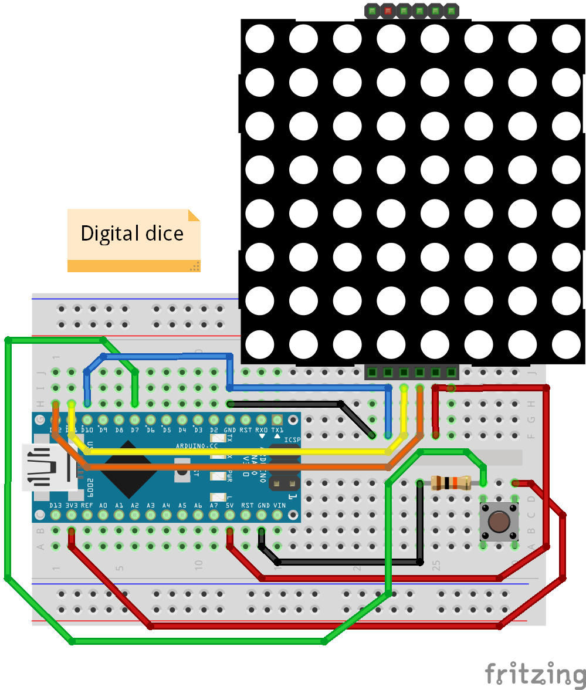

# :game_die: DigDice :game_die:

Digital Dice.    

DigDice.ino
A simple game dice with Arduino and a MAX7219 8x8 led matrix.
(This use LedControl lib)

DigDice.py
A Raspberry Pi version in Python
(Use RPimax7219 lib - https://github,com/Acidhub/RPimax7219)

### Usage (Arduino):
- :pensive: Upload DigDice.ino on your Arduino (anyone).
- :weary: Make connections like diagram (Arduino) bellow.
- :smile: Push the button!    
 :game_die: :game_die: :game_die: :game_die: :game_die: :game_die: :game_die: :game_die: :game_die: :game_die:

### Usage (Raspberry Pi, any version):
- Copy DigDice.py in your RaspberryPi
- Install spidev and RPimax7219 libs `sudo pip3 install spidev RPimax7219`
- Make connections:
   - A button on pin 17 from +3.3v
   - A buzzer on pin 18 (+) and GND
   - A MAX7219 controled Matrix on pins +3.3v, GND, 10 (DIN on MOSI), 8 (CS on CE0), 11 (CLK on SCLK)
- Run-it `sudo python3 DigDice.py`
- ?????
- PROFIT!

### Wiring:

